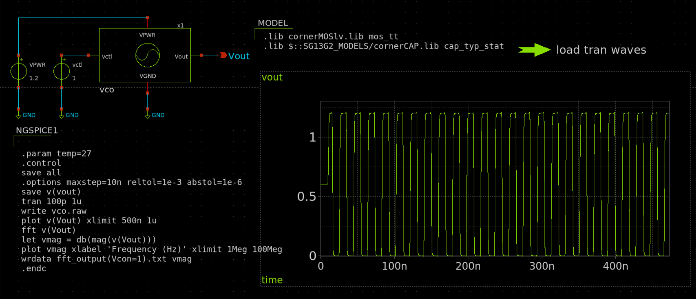

# Voltage-Controlled Oscillator (VCO) in IHP SG13G2 Process

# Table of Contents

1. [Overview](#overview)  
2. [Specifications](#specs)  
3. [Circuit Design](#circuit)  
    - [Inverter Cell](#inv)  
    - [11-Stage Ring Oscillator](#ring)  
    - [Control Mechanism](#ctrl)  
4. [Simulation Results (Pre-Layout)](#sim)  
    - [Oscillation Waveform](#sim_out)  
    - [Frequency Spectrum](#sim_spec)  
    - [Frequency Tuning Curve](#sim_tune)  
5. [Layout Design](#layout)  
6. [Layout Information](#layout_info)  
7. [Post-Layout Verification](#pex)  
8. [References](#ref)  

---

## 1. Overview
This repository contains the design and layout of a **current-starved, 11-stage ring oscillator VCO** implemented in the **IHP SG13G2 130 nm CMOS process**.  

The VCO generates a tunable oscillation frequency controlled by an external voltage input.  
Key goals of the design are:  
- Wide frequency tuning range  
- Robust operation across process-voltage-temperature (PVT) corners  
- Low power consumption  
- Compact layout area  

[Return to top](#toc)

---

## 2. Specifications

| **Parameter**          | **Value**       |
|-------------------------|-----------------|
| Technology              | IHP SG13G2      |
| Supply Voltage          | 1.2 V           |
| Oscillation Frequency   | ~50 MHz (nominal at Vctrl = 1 V) |
| Control Voltage Range   | 0 – 1.2 V       |
| Number of Stages        | 11              |
| Device Type             | LVT NMOS/PMOS   |
| Layout Area             | 2246.58 µm²     |

[Return to top](#toc)

---

## 3. Circuit Design

### 3.1 Inverter Cell
Each stage of the oscillator is implemented using a CMOS inverter. Delay is controlled by current-limiting transistors.  

  

### 3.2 11-Stage Ring Oscillator
An 11-stage ring of inverters provides stable oscillation in the MHz range.  

  

### 3.3 Control Mechanism
- A transistor in **triode region** limits current, tuning the inverter delay and oscillation frequency.  
- **Low-threshold (LVT) NMOS devices** keep control voltage in the mid-supply range for stability.  
- **Keeper devices** allow the oscillator to be disabled, consuming zero static power when off.  

[Return to top](#toc)

---

## 4. Simulation Results (Pre-Layout)

### 4.1 Oscillation Waveform at Vctrl = 1 V  

  
Output frequency ≈ **50 MHz**

### 4.2 Frequency Spectrum  

  

### 4.3 Frequency Tuning Curve  
Frequency vs. control voltage characteristic:  

  

[Return to top](#toc)

---

## 5. Layout Design
### 5.1 VCO Layout
- Total VCO layout area: **2246.58 µm²**  
- Designed in IHP SG13G2 process with all active + metal layers.  

  

### 5.2 Final VCO Layout (without Fillers) 

  

### 5.3 Final VCO Layout (with Fillers) 
- Total Chip area: **90000.00 µm²**  
- Designed in IHP SG13G2 process with all active + metal layers.  

  

[Return to top](#toc)

---

## 6. Layout Information

|               | **Width (µm)** | **Height (µm)** | **Pitch (µm)** | **Area (µm²)** |   Layers   |
|---------------|----------------|-----------------|----------------|----------------|------------|
| **Layout**    | 300            | 300             | N/A              | 90,000        |    all     |
| **Pads**      | 40             | 40              | 75             | 3,600          |  TM2 -  M3 |
| **RF Pads**   | 40             | 40              | 75             | ~2,984         |  TM2 - TM1 |

[Return to top](#toc)

---

---

## 7. Physical Verification (DRC, LVS)

### Design Rule Check (DRC) Results

### Layout vs. Schematics (LVS) Results 

[Return to top](#toc)

---

## 8. Post-layout Verification after PEX
Parasitic-extracted (PEX) simulations confirm consistent oscillation. Frequency shifts due to parasitics are within acceptable margins, preserving tuning characteristics.

  

[Return to top](#toc)

---

## 9. References
- tt08-tiny-pll - [https://github.com/LegumeEmittingDiode/tt08-tiny-pll](https://github.com/LegumeEmittingDiode/tt08-tiny-pll)  
- avsdpll_1v8 - [https://github.com/lakshmi-sathi/avsdpll_1v8](https://github.com/lakshmi-sathi/avsdpll_1v8)  

[Return to top](#toc)
